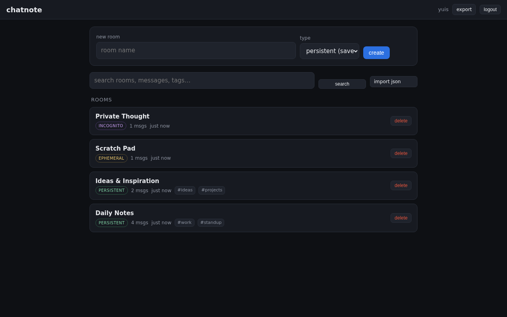
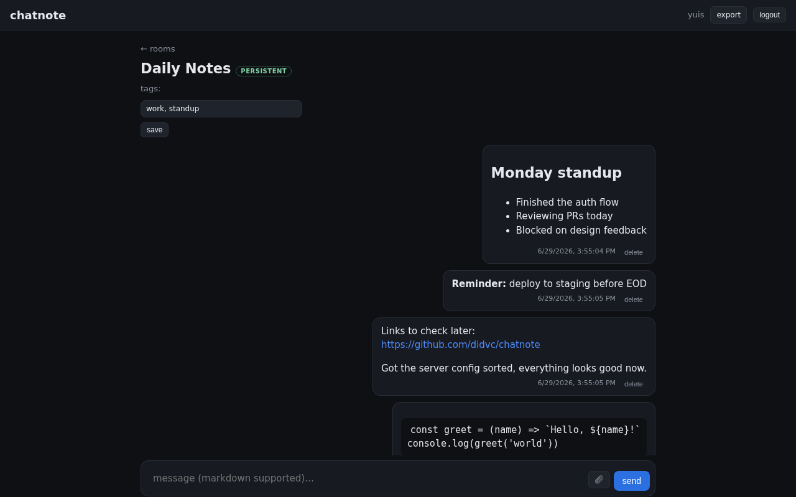
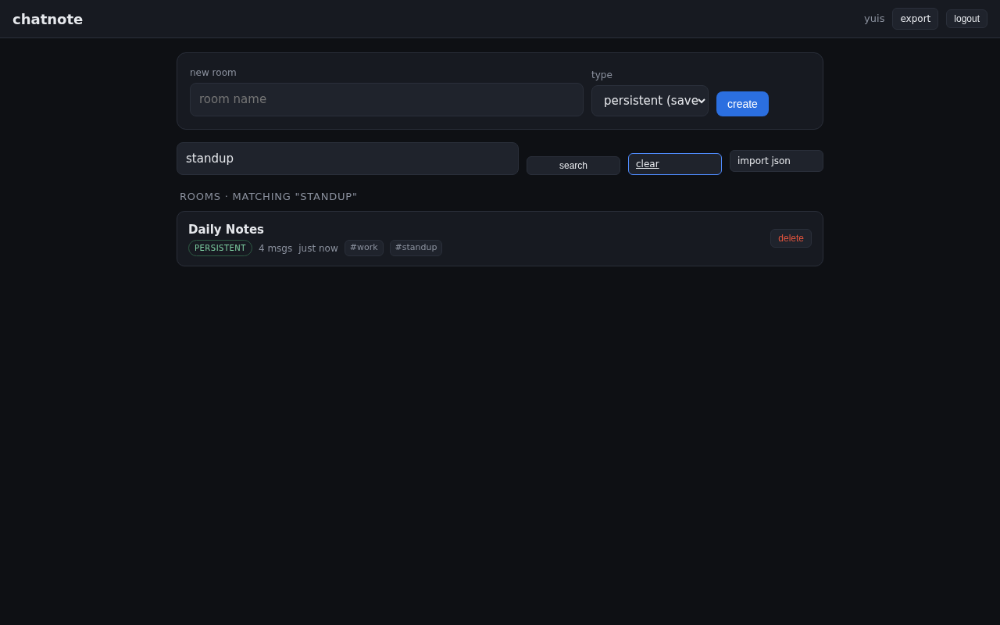
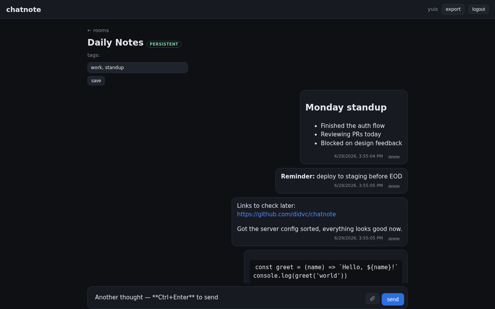

# chatnote

[](https://github.com/didvc/chatnote/actions/workflows/ci.yml)
[](https://didvc.github.io/chatnote/)
[](LICENSE)

**[Full documentation →](https://didvc.github.io/chatnote/)**

Your own note-to-self chatrooms — infinite rooms, like a private Telegram "Saved Messages". Self-hosted, open-source, Astro SSR + Prisma/SQLite.

## Screenshots

<table>
  <tr>
    <td></td>
    <td></td>
  </tr>
  <tr>
    <td align="center"><em>Room list — all three room types, tags visible</em></td>
    <td align="center"><em>Persistent room — Markdown rendered server-side</em></td>
  </tr>
  <tr>
    <td></td>
    <td></td>
  </tr>
  <tr>
    <td align="center"><em>Search across rooms, messages, and tags</em></td>
    <td align="center"><em>Composer — Markdown, image attach, Ctrl+Enter to send</em></td>
  </tr>
</table>

## Room types

| Type | Storage | Lifetime |
|------|---------|----------|
| **persistent** | SQLite (disk) | until you delete it |
| **ephemeral** | Node heap (RAM) | TTL, or until the process restarts — not a retention guarantee |
| **incognito** | Node heap (RAM) | until the tab closes (client-fired wipe via `sendBeacon`) |

## Features

- Markdown messages — rendered server-side, sanitized (XSS-safe)
- Image attachments — disk for persistent rooms, inline data-URL in RAM for ephemeral/incognito
- Link previews — persistent rooms only, with SSRF guard
- Room tags + search across names, messages, and tags
- JSON import / export (persistent rooms)
- Multi-user with password auth, or `require_password = false` anonymous demo mode
- All limits configurable: per-user room cap, per-room message cap, image size, heap budget

## Quick start

```bash
git clone https://github.com/didvc/chatnote
cd chatnote
npm install
cp config.example.toml config.toml
npm run db:push
npm run dev          # http://localhost:4321
```

Production:

```bash
npm run build
npm start
```

## Config (`config.toml`)

Loaded once at server launch. See [`config.example.toml`](config.example.toml) and the [config reference](https://didvc.github.io/chatnote/reference/config).

Key flags:

| Flag | Default | Purpose |
|------|---------|---------|
| `require_password` | `true` | Set `false` for anonymous demo mode |
| `allow_image_uploads` | `true` | Set `false` on public demos |
| `allow_link_previews` | `true` | Server-side link unfurling (persistent rooms only) |
| `wipe_persistent_every` | `"off"` | e.g. `"1d"` for a daily demo wipe |

## License

Apache-2.0
